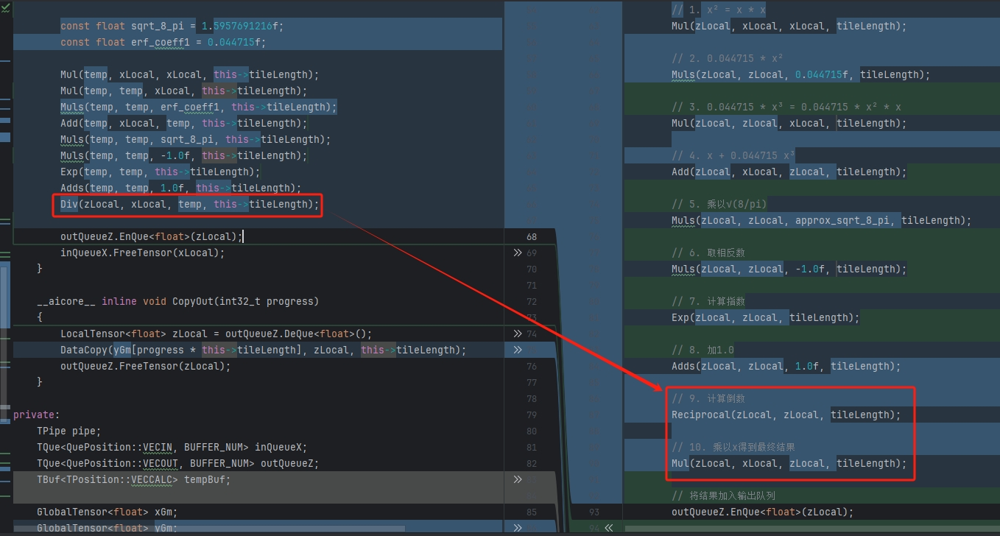
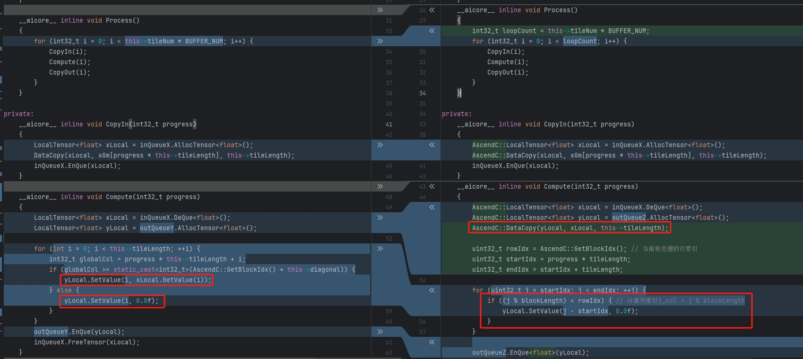

# NPUKernelBench V2.0：集成领域知识注入模型的AscendC算子生成与测评框架

[[License](https://img.shields.io/badge/license-Apache%202.0-blue.svg)](LICENSE)

## 1. 简介

NPUKernelBench V2.0框架面向华为昇腾NPU，专注于大模型算子生成与系统化测评，可对基于大语言模型自动生成的AscendC算子进行全面测评。除框架本身外，本次还同步推出了一个基于高质量CoT (Chain–of–Thought)数据训练的大语言模型，这些数据深度融合了AscendC的领域知识和编程范式。通过这一学习过程，模型能够模拟算子开发工程师在硬件约束下的设计思维，并在算子生成能力上实现突破：可直接根据自然语言或功能描述，生成逾50种可用的AscendC内核，生成数量较可行性验证版本V1.0提升400%，代码质量与实用性也得到大幅增强。

## 2. 核心特性

- **标准化的分级任务集**：提供了一系列覆盖不同难度和应用场景的算子任务，详见设计理念部分
- **LLM 驱动的代码生成**：内置与LLM交互的模块，可解析任务需求，提供自动生成完整的 NPU Ascend C 算子实现的实践
- **自动化的评估框架**：提供一整套自动化脚本，用于批量管理算子的编译、精度验证和性能测试
- **精确的验证与计分体系**：每个任务都配有 PyTorch 对标实现和详细测试用例，确保评估的准确性
- **详实的配套文档**：提供了从入门、任务说明、评估规则到 LLM 使用的全方位指南（详见 `docs` 目录）

## 3. Benchmark 设计理念

为了系统性地衡量不同算子的实现质量，我们从任务设定和评估规则两个维度进行了精心设计。

### 3.1 任务结构与分类

所有测试任务均存放于 `/tasks` 目录，并遵循 `level/Category/OperatorName` 的层级结构：

**难度分级 (Level)**：
- `level1`: **基础算子**。通常是单输入、单输出、无复杂属性的算子，如 `Sqrt`、`Equal`
- `level2`: **常用复合算子**。涉及多个输入、更复杂的计算逻辑或融合模式，如 `AddLayerNorm`、`GeluGrad`
- `level3`: **高阶复杂算子**。通常具有动态shape、复杂并行逻辑或特殊数据编排需求，如 `TopKV3`、`GroupedMatmul`

**内部结构**：每个算子任务内均包含 `question`（问题描述和代码模板）、`answer`（Golden参考答案）和 `validation`（验证工具和数据）三个子目录。

> 👉 **想了解更多？请查阅 [详细的任务设计说明](./docs/BENCHMARK_TASKS.md)**

### 3.2 评估与计分规则

我们的评估流程覆盖了算子开发的三个核心环节：

1. **编译正确性**：代码能否成功通过 CANN 工具链的编译
2. **精度正确性**：在相同的输入下，NPU 算子的输出与 PyTorch 对标实现的输出之间的误差是否在允许范围内。我们通常使用**双千分之一**作为初步的核心精度指标
3. **性能**：在保证精度达标的前提下，评估算子在 NPU 上的执行速度。核心指标为**运行延迟 (Latency)** 和归一化的计算性能 **FLOPS**

> 👉 **想了解更多？请查阅 [详细的评估计分规则](./docs/BENCHMARK_EVALUATION.md)**

## 4. 快速开始

### 4.1 环境准备

1. **克隆项目**
   ```bash
   git clone https://openi.pcl.ac.cn/stepbystepbin/NPUKernelBench.git
   cd NPUKernelBench
   ```

2. **设置环境**
   ```bash
   source set_framework_env.sh
   ```

3. **安装 Python 依赖**
   ```bash
   pip install -r requirements.txt
   ```

4. **安装 vLLM-Ascend**
   
   参考 vllm-ascend 官方安装文档：https://vllm-ascend.readthedocs.io/en/v0.7.3-dev/installation.html

5. **启动 vLLM 服务**
   
   修改 `base_config.yaml` 文件中的模型权重路径为实际的模型权重路径，然后启动 vLLM 进程：
   ```bash
   nohup bash start_vllm_server.sh > vllm_server.log 2>&1 &
   ```
   > 👉 **vllm启动方式请查阅 [vLLM 服务启动文档](./docs/START_VLLM_SERVER)**

### 4.2 运行示例

以 `Sqrt` 和 `SwiGlu`算子为例，使用官方提供的参考答案进行一次完整的评估：

```bash
python run_multi_test.py -chat -task_name Sqrt SwiGlu
```

观察终端输出，您将看到这两个算子在模型生成、编译、精度测试的全过程日志。

> 👉 **需要更详尽的步骤？请参考 [入门指南](./docs/BENCHMARK_EVALUATION.md)**

## 5. 典型工作流程

使用 NPUKernelBench 的典型工作流程如下：


### 5.1 选择任务
从 `tasks` 目录下选择一个或多个算子任务进行处理，例如 `tasks/level1/Math/Sqrt`

### 5.2 获取算子实现

**方式一：大语言模型（LLM）自动生成**


执行代码生成脚本，让 LLM 自动编写内核代码：
```bash
python run_multi_test.py -chat -task_name Sqrt -stages code_gen
```
生成的代码将保存在 `runs/msopgen/lvl1/Math/Sqrt/fixed_case_0/samplex` 目录下，其中 `samplex` 对应模型生成的第 `x` 个采样结果，系统默认：调用模型生成 100 次算子 kernel，采用静态 shape 测试模式，kernel only模版。
> 👉 **LLM 功能的详细用法请参考 [LLM 内核生成指南](./docs/LLM_KERNEL_GENERATION.md)**

**方式二：手动开发**

阅读任务目录下的 `api_desc.md` 和 `question/` 中的代码模板，手动完成 `op_kernel/*.cpp` 中的算子逻辑。

### 5.3 执行评估

运行主脚本 `run_multi_test.py`，指定任务和代码路径，启动全自动评估流程：

- **评估 LLM 生成的代码（包含编译和精度测试）**：
  ```bash
  python run_multi_test.py -chat -task_name Sqrt -stages compile precision
  ```

- **评估手动编写的代码（包含编译和精度测试）**：
  ```bash
  python run_multi_test.py -task_name Sqrt -stages compile precision
  ```

## 6. 目录结构概览

```
NPUKernelBench/
├── docs/                      # 项目说明与指南文档
├── framework/                 # 自动化测试与评估框架核心逻辑
├── kernel_generator/          # LLM 内核生成器
├── libs/                      # 依赖库 (CANN, JSON等)
├── model_generated_kernels/   # LLM 生成的部分算子代码样例：含思维连和Kernle实现
├── tasks/                     # 核心：基准测试任务集
├── base_config.yaml           # 全局配置文件
├── run_multi_test.py          # 总执行入口脚本
├── start_vllm_server.sh       # 启动 vLLM 脚本
└── set_framework_env.sh       # 环境设置脚本
```

## 7. 典型案例解析

### 7.1 Gelu算子

以下展示了两个通过精度测试的Gelu算子实现对比：



从对比结果可以看出，两种实现在大部分计算步骤上保持一致，主要差异在于最终的除法运算`x/y`的处理方式。左侧实现直接使用`Div`接口完成除法操作，而右侧实现采用了先计算`y`的倒数`Reciprocal`，再与`x`执行`Mul`乘法运算的方式。这体现了模型在算子实现上的多样性特点。


>  👉 Gelu算子左侧用例的思维链过程 [请点击查看](./model_generated_kernels/Gelu/sample2/generated_cot.txt)

>  👉 Gelu算子右侧用例的思维链过程 [请点击查看](./model_generated_kernels/Gelu/sample1/generated_cot.txt)

### 7.2 Triu算子

`Triu`算子用于提取张量的上三角部分，返回包含输入矩阵上三角元素的张量，其余位置填充为0。上三角部分指定对角线`diagonal`及其上方的所有元素。参数`diagonal`控制对角线位置：0表示主对角线，正值表示主对角线上方，负值表示主对角线下方。

以下展示了两个通过精度测试的Triu算子实现对比：



两种实现策略存在明显差异：左侧采用逐元素条件判断的方式，根据位置决定是保留原值还是置零；右侧则先将输入张量完整拷贝到输出张量，再对指定区域进行置零操作。后者通过减少`SetValue`次数，在性能上更为高效。

>  👉 Triu算子左侧用例的思维链过程 [请点击查看](./model_generated_kernels/Triu/sample1/generated_cot.txt)

>  👉 Triu算子右侧用例的思维链过程 [请点击查看](./model_generated_kernels/Triu/sample2/generated_cot.txt)


## 8. 许可证

本项目采用 [Apache 2.0 License](LICENSE) 开源许可证。