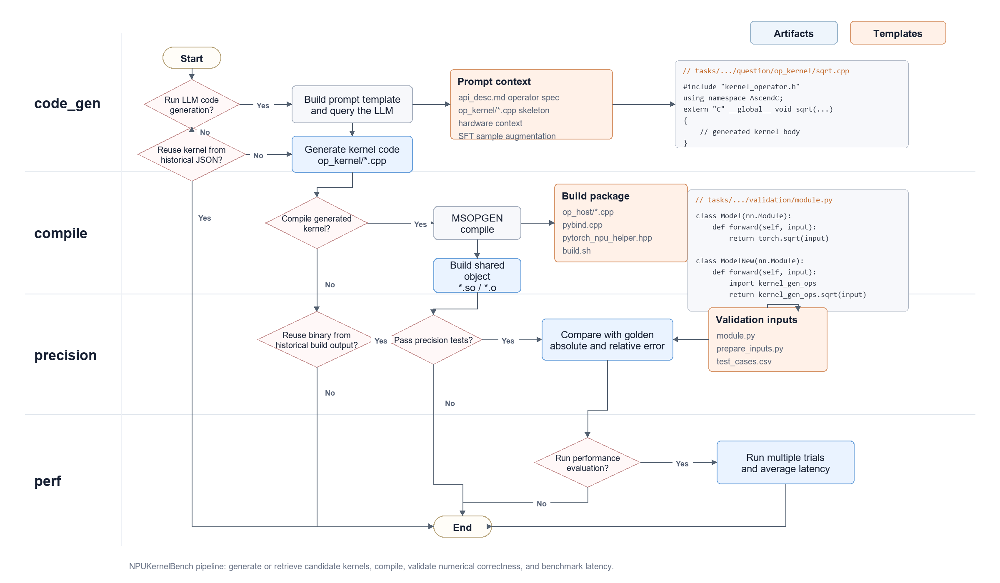
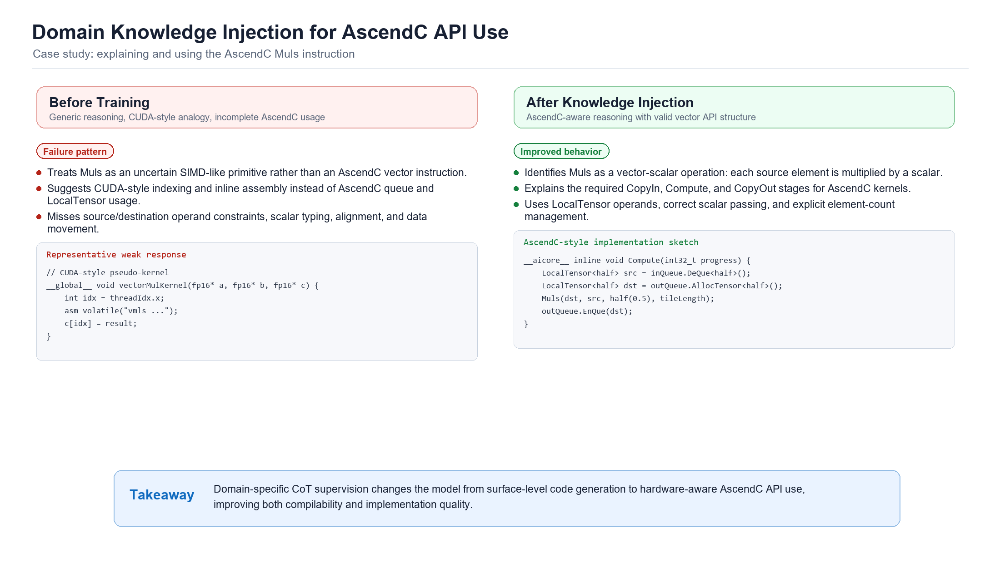
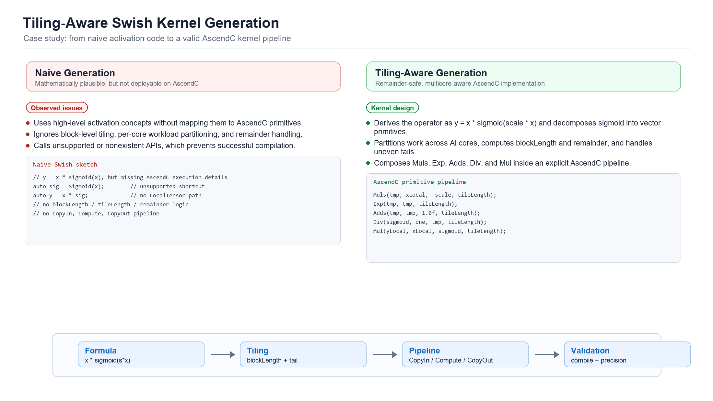

# NPUKernelBench V2.0：集成领域知识注入模型的AscendC算子生成与测评框架

[[License](https://img.shields.io/badge/license-Apache%202.0-blue.svg)](LICENSE)

## 1. 简介

NPUKernelBench V2.0框架面向华为昇腾NPU，专注于大模型算子生成与系统化测评，可对基于大语言模型自动生成的AscendC算子进行全面测评。除框架本身外，本次还同步推出了一个基于高质量CoT (Chain–of–Thought)数据训练的大语言模型，这些数据深度融合了AscendC的领域知识和编程范式。通过这一学习过程，模型能够模拟算子开发工程师在硬件约束下的设计思维，并在算子生成能力上实现突破：可直接根据自然语言或功能描述，生成逾50种可用的AscendC内核，生成数量较可行性验证版本V1.0提升400%，代码质量与实用性也得到大幅增强。

## 2. 核心特性

- **标准化的分级任务集**：提供了一系列覆盖不同难度和应用场景的算子任务，详见设计理念部分
- **LLM 驱动的代码生成**：内置与LLM交互的模块，可解析任务需求，提供自动生成完整的 NPU Ascend C 算子实现的实践
- **自动化的评估框架**：提供一整套自动化脚本，用于批量管理算子的编译、精度验证和性能测试
- **精确的验证与计分体系**：每个任务都配有 PyTorch 对标实现和详细测试用例，确保评估的准确性
- **详实的配套文档**：提供了从入门、任务说明、评估规则到 LLM 使用的全方位指南（详见 `docs` 目录）

## 3. Benchmark 设计理念

为了系统性地衡量不同算子的实现质量，我们从任务设定和评估规则两个维度进行了精心设计。

### 3.1 任务结构与分类

所有测试任务均存放于 `/tasks` 目录，并遵循 `level/Category/OperatorName` 的层级结构：

**难度分级 (Level)**：
- `level1`: **基础算子**。通常是单输入、单输出、无复杂属性的算子，如 `Sqrt`、`Equal`
- `level2`: **常用复合算子**。涉及多个输入、更复杂的计算逻辑或融合模式，如 `AddLayerNorm`、`GeluGrad`
- `level3`: **高阶复杂算子**。通常具有动态shape、复杂并行逻辑或特殊数据编排需求，如 `TopKV3`、`BasicMatmul`

**内部结构**：每个算子任务内均包含 `question`（问题描述和代码模板）、`answer`（Golden参考答案）和 `validation`（验证工具和数据）三个子目录。

> 👉 **想了解更多？请查阅 [详细的任务设计说明](./docs/BENCHMARK_TASKS.md)**

### 3.2 评估与计分规则

我们的评估流程覆盖了算子开发的三个核心环节：

1. **编译正确性**：代码能否成功通过 CANN 工具链的编译
2. **精度正确性**：在相同的输入下，NPU 算子的输出与 PyTorch 对标实现的输出之间的误差是否在允许范围内。我们通常使用**双千分之一**作为初步的核心精度指标
3. **性能**：在保证精度达标的前提下，评估算子在 NPU 上的执行速度。核心指标为**运行延迟 (Latency)** 和归一化的计算性能 **FLOPS**

> 👉 **想了解更多？请查阅 [详细的评估计分规则](./docs/BENCHMARK_EVALUATION.md)**

## 4. 快速开始

### 4.1 环境准备

1. **克隆项目**
   ```bash
   git clone https://github.com/weich97/NPUKernelBench.git
   cd NPUKernelBench
   ```

2. **设置环境**
   ```bash
   source set_framework_env.sh
   ```

3. **安装 Python 依赖**
   ```bash
   pip install -r requirements.txt
   ```

4. **安装 vLLM-Ascend**
   
   参考 vllm-ascend 官方安装文档：https://docs.vllm.ai/projects/ascend/en/latest/installation.html。你需要vllm 0.7.3-dev或更高版本。

5. **启动 vLLM 服务**
   
   修改 `base_config.yaml` 文件中的模型权重路径为实际的模型权重路径，然后启动 vLLM 进程：
   ```bash
   nohup bash start_vllm_server.sh > vllm_server.log 2>&1 &
   ```
   > 👉 **vllm启动方式请查阅 [vLLM 服务启动文档](./docs/START_VLLM_SERVER.md)**

### 4.2 运行示例

以 `Sqrt` 和 `SwiGlu`算子为例，使用官方提供的参考答案进行一次完整的评估：

```bash
python run_multi_test.py -chat -task_name Sqrt SwiGlu
```

观察终端输出，您将看到这两个算子在模型生成、编译、精度测试的全过程日志。

> 👉 **需要更详尽的步骤？请参考 [入门指南](./docs/BENCHMARK_EVALUATION.md)**

## 5. 典型工作流程

使用 NPUKernelBench 的典型工作流程如下：


### 5.1 选择任务
从 `tasks` 目录下选择一个或多个算子任务进行处理，例如 `tasks/level1/Math/Sqrt`

### 5.2 获取算子实现

**方式一：大语言模型（LLM）自动生成**


执行代码生成脚本，让 LLM 自动编写内核代码：
```bash
python run_multi_test.py -chat -task_name Sqrt -stages code_gen
```
生成的代码将保存在 `runs/msopgen/lvl1/Math/Sqrt/fixed_case_0/samplex` 目录下，其中 `samplex` 对应模型生成的第 `x` 个采样结果，系统默认：调用模型生成 100 次算子 kernel，采用静态 shape 测试模式，kernel only模版。
> 👉 **LLM 功能的详细用法请参考 [LLM 内核生成指南](./docs/LLM_KERNEL_GENERATION.md)**

**方式二：手动开发**

阅读任务目录下的 `api_desc.md` 和 `question/` 中的代码模板，手动完成 `op_kernel/*.cpp` 中的算子逻辑。

### 5.3 执行评估

运行主脚本 `run_multi_test.py`，指定任务和代码路径，启动全自动评估流程：

- **评估 LLM 生成的代码（包含编译和精度测试）**：
  ```bash
  python run_multi_test.py -chat -task_name Sqrt -stages compile precision
  ```

- **评估手动编写的代码（包含编译和精度测试）**：
  ```bash
  python run_multi_test.py -task_name Sqrt -stages compile precision
  ```

## 6. 目录结构概览

```
NPUKernelBench/
├── docs/                      # 项目说明与指南文档
├── framework/                 # 自动化测试与评估框架核心逻辑
├── kernel_generator/          # LLM 内核生成器
├── libs/                      # 依赖库 (CANN, JSON等)
├── tasks/                     # 核心：基准测试任务集
├── base_config.yaml           # 全局配置文件
├── run_multi_test.py          # 总执行入口脚本
├── start_vllm_server.sh       # 启动 vLLM 脚本
└── set_framework_env.sh       # 环境设置脚本
```

## 7. 典型案例解析

### 7.1 知识注入效果对比示例

下图中具体案例（AscendC中Muls指令的使用方式）展示了CoT领域知识注入对大模型在专业知识理解与代码生成能力上带来的质变。



**🤔 原始回答内容 (训练前):**
该响应表现出高度的不确定性（如使用“可能”、“假设”等词汇）。模型试图从通用编程知识中进行类比，但对AscendC的特定API、Muls指令的精确用法及其在Ascend处理器架构中的上下文缺乏准确认知。其提供的代码示例（如hip/hip_runtime.h）是错误的，并明确暴露出其知识的匮乏（如“缺乏具体的文档”、“无法实现”）。

**🎓 优化后回答内容 (训练后):**
该响应则展现了清晰的专家逻辑。

* **🧠 结构化思考 (`<think>`):** 模型首先通过思维链准确分析了Muls指令的背景（向量乘法）、关键参数（如src0、dst）以及数据布局（如src0需为Scalar或src0区配）等核心约束。
* **✅ 准确实现:** 模型接着提供了正确且具体的实现步骤，包括初始化、Local Tensor内存的InQueue/OutQueue管理、数据搬运 (CopyIn) 以及核心计算调用 (ScalarValue)。
* **⌨️ 代码正确性:** 最终生成的代码示例（aicore__void Compute()）准确地使用了AscendC API，展现了对数据排队和向量指令的正确理解。

### 7.2 生成算子对比示例

下图中具体案例（AscendC中实现一个Swish算子）展示了CoT领域知识注入对大模型在复杂算子实现与Tiling策略理解能力上带来的质变。



**🤔 原始回答内容 (训练前):** 该响应在核心的Tiling策略上表现出高度的不确定性（如使用“可能”、“显然不行”、“假设”等词汇）。模型试图进行简单的算术除法（1024/48=21.33），但完全不理解Ascend核心的调度机制，也无法处理非整除的余数。其对Swish算子本身的实现逻辑也较为混乱（如Negate, Reciprocal, Multiply的组合），对核心API的调用缺乏准确认知，最终承认“无法通过”编译。

**🎓 优化后回答内容 (训练后):** 
该响应则展现了清晰的专家逻辑。

* **🧠 结构化思考 (`<think>`):** 模型首先通过思维链准确分析了Swish算子的数学公式（$y = x \times \text{sigmoid}(x)$）与输入规格。更重要的是，它设计了健壮的Tiling策略：准确识别出总任务量（1024）和核心数（48），并制定了处理余数的不均匀分配方案（前47个核心处理21个元素，最后1个核心处理37个元素）。
* **✅ 准确实现:** 模型接着在Init()函数中正确实现了该Tiling逻辑（计算blockLength和remainder）。在Compute()函数中，它提供了正确且具体的算子实现步骤，通过组合Muls, Exp, Adds, Div等 AscendC 指令，一步步实现了 Sigmoid 函数并最终完成了Swish计算。
* **⌨️ 代码正确性:** 最终生成的代码示例（aicore__void Init(), aicore__void Compute()）准确地使用了AscendC API，不仅展现了对算子数学逻辑的正确理解，也展现了对多核并行与Tiling策略的深刻掌握。

## 8. 许可证

本项目采用 [Apache 2.0 License](LICENSE) 开源许可证。
